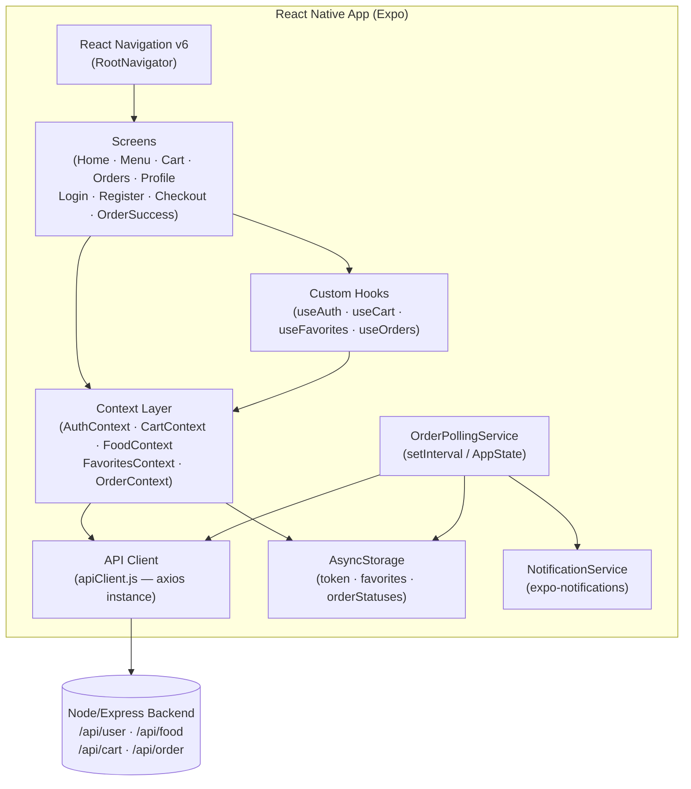

# Technical Design Document

## Feature: react-native-food-delivery-app

---

## Overview

This document describes the technical architecture for a React Native (Expo) food delivery mobile app targeting iOS and Android. The app mirrors the existing web frontend's feature set — browsing food items, managing a cart, placing orders via Stripe, and viewing order history — while adding mobile-native features: push notifications for order status changes via polling, and a locally persisted favorites system. It consumes the existing Node.js/Express + MongoDB backend without modification, authenticating via JWT stored in AsyncStorage. Navigation uses React Navigation v6 with a bottom tab bar. State management follows the existing web app's pattern using React Context API.

---

## Architecture

The app follows a layered architecture: screens consume context state, context state is fed by an API client layer, and persistent state lives in AsyncStorage. Side-effect services (polling, notifications) are encapsulated in dedicated modules.



---

## Components and Interfaces

### Navigation Structure

```
RootNavigator (Stack)
├── AuthStack (Stack)               ← shown when no token in AsyncStorage
│   ├── LoginScreen
│   └── RegisterScreen
└── AppTabs (Bottom Tab Navigator)  ← shown when token present
    ├── HomeStack (Stack)
    │   ├── HomeScreen
    │   └── FoodDetailScreen
    ├── MenuStack (Stack)
    │   ├── MenuScreen
    │   └── FoodDetailScreen
    ├── CartStack (Stack)
    │   ├── CartScreen
    │   └── CheckoutScreen
    │       └── StripeWebViewScreen (modal/full-screen Stack)
    ├── OrdersStack (Stack)
    │   └── OrdersScreen
    └── ProfileStack (Stack)
        └── ProfileScreen
```

**Tab guard:** The `AppTabs` navigator is only reachable once `AuthContext.token` is non-null. Unauthenticated deep-links to Cart / Orders / Profile redirect to `LoginScreen`.

---

### Screen and Component Breakdown

#### 3.1 Screens

| Screen | Stack | Auth required |
|---|---|---|
| `LoginScreen` | AuthStack | No |
| `RegisterScreen` | AuthStack | No |
| `HomeScreen` | HomeStack | No (read-only) |
| `MenuScreen` | MenuStack | No (read-only) |
| `FoodDetailScreen` | Home/MenuStack | No |
| `CartScreen` | CartStack | Yes |
| `CheckoutScreen` | CartStack | Yes |
| `StripeWebViewScreen` | CartStack (modal) | Yes |
| `OrdersScreen` | OrdersStack | Yes |
| `ProfileScreen` | ProfileStack | Yes |

#### 3.2 Shared Components

```
src/
  components/
    FoodCard.jsx          ← image, name, price, description, heart toggle, add/remove
    CategoryPill.jsx      ← single tappable category chip
    CartBadge.jsx         ← numeric badge overlay on Cart tab icon
    OrderStatusBadge.jsx  ← colored pill for Food Processing / Out for Delivery / Delivered
    FavoritesSection.jsx  ← horizontal scroll of FoodCard with empty state
    PromoBanner.jsx       ← static or scrollable featured categories strip
    LoadingSpinner.jsx    ← centered ActivityIndicator wrapper
    ErrorState.jsx        ← error message + retry button
    AddressForm.jsx       ← reusable form for CheckoutScreen
```

#### 3.3 Screen Details

**HomeScreen**
- Header: app logo + search `TextInput`
- `PromoBanner` (horizontal `ScrollView`)
- `FavoritesSection` (reads from `FavoritesContext`)
- Full food grid (`FlatList`, 2-column, data from `FoodContext`)
- Search filters grid in real-time via `useMemo`

**MenuScreen**
- `CategoryPill` horizontal scroll (derives unique categories from `FoodContext`)
- `FlatList` of `FoodCard` components filtered by active category

**CartScreen**
- `FlatList` of cart rows (name · qty stepper · line total)
- Subtotal / Delivery ₹50 / Grand Total summary row
- "Proceed to Checkout" button

**CheckoutScreen**
- `AddressForm` (first name, last name, email, street, city, state, zip, country, phone)
- "Place Order" button → calls `POST /api/order/place`
- On `session_url` response, navigates to `StripeWebViewScreen`

**StripeWebViewScreen**
- Full-screen `WebView` pointed at `session_url`
- `onNavigationStateChange` listens for URLs containing `/verify`
- Extracts `success` and `orderId` query params, calls `POST /api/order/verify`

**OrdersScreen**
- `FlatList` of order cards (date, items list, total, payment pill, status badge)
- Orders sorted by `date` descending
- `RefreshControl` triggers re-fetch

**ProfileScreen**
- Name and email display
- "Logout" button

---

### State Management and Data Flow

React Context API is used exclusively — no Redux. Each context owns a slice of state and exposes actions. Contexts are composed in `AppProviders.jsx`.

```
AppProviders
├── AuthContext
├── FoodContext
├── FavoritesContext   (reads from AsyncStorage on mount)
├── CartContext        (depends on AuthContext token)
└── OrderContext       (depends on AuthContext token)
```

#### 4.1 AuthContext

```javascript
// src/context/AuthContext.jsx
const AuthContext = createContext();

// State
{
  token: string | null,   // loaded from AsyncStorage("token") on startup
  user: { name, email } | null,
  loading: boolean,
}

// Actions
login(email, password)     // POST /api/user/login → store token → set user
register(name, email, pw)  // POST /api/user/register → store token → set user
logout()                   // remove token, clear cart, stop polling, navigate Login
```

On app start, `AuthContext` reads `AsyncStorage.getItem('token')` to restore session. If a token is found, user data (name/email) is stored in-memory from the original login response (or from a dedicated `/api/user/me` if available — otherwise kept from login payload).

#### 4.2 FoodContext

```javascript
// State
{
  foods: FoodItem[],        // from GET /api/food/list
  loading: boolean,
  error: string | null,
}

// Actions
fetchFoods()  // called on app mount
```

`FoodItem` shape mirrors the backend model:
```javascript
{
  _id: string,
  name: string,
  description: string,
  price: number,
  image: string,       // filename — full URL = BASE_URL + '/images/' + image
  category: string,
}
```

#### 4.3 CartContext

```javascript
// State
{
  cartData: { [itemId: string]: number },  // mirrors backend cartData shape
  loading: boolean,
}

// Actions
loadCart()             // POST /api/cart/get
addToCart(itemId)      // POST /api/cart/add → optimistic update
removeFromCart(itemId) // POST /api/cart/remove → optimistic update
clearCart()            // local only — sets cartData to {}
```

Cart item count = `Object.values(cartData).reduce((s, v) => s + v, 0)`

#### 4.4 FavoritesContext

```javascript
// State
{
  favorites: string[],   // array of FoodItem _id strings
}

// Actions
toggleFavorite(itemId)   // add if absent, remove if present; persist to AsyncStorage
isFavorite(itemId)       // boolean selector
```

#### 4.5 OrderContext

```javascript
// State
{
  orders: Order[],
  loading: boolean,
  error: string | null,
}

// Actions
fetchOrders()            // POST /api/order/userorders
placeOrder(items, amount, address)  // POST /api/order/place → returns session_url
verifyOrder(orderId, success)       // POST /api/order/verify
```

`Order` shape mirrors the backend model:
```javascript
{
  _id: string,
  userId: string,
  items: Array<{ _id, name, price, quantity, ... }>,
  amount: number,
  address: object,
  status: 'Food Processing' | 'Out for Delivery' | 'Delivered',
  date: string,  // ISO date string
  payment: boolean,
}
```

---

### API Integration Layer

#### 5.1 API Client (`src/api/apiClient.js`)

```javascript
import axios from 'axios';
import AsyncStorage from '@react-native-async-storage/async-storage';

const BASE_URL = process.env.EXPO_PUBLIC_API_BASE_URL; // e.g. http://192.168.x.x:4000

const apiClient = axios.create({ baseURL: BASE_URL });

// Request interceptor: attach JWT from AsyncStorage
apiClient.interceptors.request.use(async (config) => {
  const token = await AsyncStorage.getItem('token');
  if (token) {
    config.headers['token'] = token;  // backend reads req.headers.token
  }
  return config;
});

export default apiClient;
```

> **Note:** The existing backend auth middleware reads `req.headers.token` (not `Authorization: Bearer`). The interceptor mirrors this convention.

#### 5.2 API Modules

```
src/api/
  apiClient.js     ← axios instance + interceptor
  authApi.js       ← login, register
  foodApi.js       ← listFoods
  cartApi.js       ← getCart, addToCart, removeFromCart
  orderApi.js      ← placeOrder, verifyOrder, getUserOrders
```

**authApi.js**
```javascript
export const login = (email, password) =>
  apiClient.post('/api/user/login', { email, password });

export const register = (name, email, password) =>
  apiClient.post('/api/user/register', { name, email, password });
```

**foodApi.js**
```javascript
export const listFoods = () => apiClient.get('/api/food/list');
// Image URL helper
export const getFoodImageUrl = (filename) =>
  `${BASE_URL}/images/${filename}`;
```

**cartApi.js**
```javascript
export const getCart = () => apiClient.post('/api/cart/get');
export const addToCart = (itemId) => apiClient.post('/api/cart/add', { itemId });
export const removeFromCart = (itemId) => apiClient.post('/api/cart/remove', { itemId });
```

**orderApi.js**
```javascript
export const placeOrder = (items, amount, address) =>
  apiClient.post('/api/order/place', { items, amount, address });

export const verifyOrder = (orderId, success) =>
  apiClient.post('/api/order/verify', { orderId, success });

export const getUserOrders = () =>
  apiClient.post('/api/order/userorders');
```

> `userId` is injected server-side by the auth middleware from the decoded JWT — the client never sends `userId` explicitly.

---

## Data Models

### AsyncStorage Schema

All keys are string-prefixed to avoid collisions.

| Key | Type | Description |
|---|---|---|
| `"token"` | `string` | JWT issued by backend on login/register |
| `"favorites"` | `string` (JSON array of `_id` strings) | User's saved food item IDs |
| `"orderStatuses"` | `string` (JSON object `{ [orderId]: string }`) | Last known status per order — used for polling change detection |

**Read/Write helpers (`src/storage/storageHelpers.js`)**

```javascript
export const getToken = () => AsyncStorage.getItem('token');
export const setToken = (token) => AsyncStorage.setItem('token', token);
export const removeToken = () => AsyncStorage.removeItem('token');

export const getFavorites = async () => {
  const raw = await AsyncStorage.getItem('favorites');
  return raw ? JSON.parse(raw) : [];
};
export const setFavorites = (ids) =>
  AsyncStorage.setItem('favorites', JSON.stringify(ids));

export const getOrderStatuses = async () => {
  const raw = await AsyncStorage.getItem('orderStatuses');
  return raw ? JSON.parse(raw) : {};
};
export const setOrderStatuses = (statusMap) =>
  AsyncStorage.setItem('orderStatuses', JSON.stringify(statusMap));
```

---

### Stripe WebView Payment Flow

```
CheckoutScreen
  │
  ├─[user submits address]──► POST /api/order/place
  │                                │
  │                         { success: true, session_url }
  │                                │
  └─────────────────────────────► navigate('StripeWebView', { url: session_url })
                                   │
                           <WebView source={{ uri: session_url }} />
                                   │
                    onNavigationStateChange(navState)
                           │               │
                   url includes '/verify'   │
                           │               │
               parse orderId, success      │
               from query string           │
                           │
               POST /api/order/verify
                   │              │
           success: true     success: false
                   │              │
           clearCart()        navigate('Cart')
           navigate('Orders')  show error toast
           show success toast
```

**URL parsing in `StripeWebViewScreen.jsx`:**

```javascript
import { URL } from 'react-native-url-polyfill'; // or manual string split

const handleNavChange = (navState) => {
  if (navState.url.includes('/verify')) {
    const parsed = new URL(navState.url);
    const success = parsed.searchParams.get('success');  // "true" or "false"
    const orderId = parsed.searchParams.get('orderId');
    // close WebView, dispatch verify
    navigation.goBack();
    verifyOrder(orderId, success);
  }
};
```

> The backend's Stripe session is currently configured with `success_url` and `cancel_url` pointing to `http://localhost:5173/verify`. The mobile app intercepts the WebView navigation before it lands on that URL — no backend change needed. A URL polyfill (`react-native-url-polyfill`) is required since the `URL` global is not available in the Hermes JS engine.

---

### Order Status Polling Mechanism

#### 8.1 OrderPollingService (`src/services/OrderPollingService.js`)

The service is a singleton module. `AuthContext.logout()` calls `stop()` to clean up.

```javascript
import { AppState } from 'react-native';
import { getUserOrders } from '../api/orderApi';
import { getOrderStatuses, setOrderStatuses } from '../storage/storageHelpers';
import { scheduleStatusNotification } from './NotificationService';

const POLL_INTERVAL_MS = 30_000;       // 30 seconds
const BG_TIMEOUT_MS = 10 * 60 * 1000; // 10 minutes

let intervalId = null;
let bgTimer = null;
let appStateListener = null;

const poll = async () => {
  try {
    const response = await getUserOrders();
    if (!response.data.success) return;

    const orders = response.data.data;
    const storedStatuses = await getOrderStatuses();
    const updatedStatuses = { ...storedStatuses };
    let hasActiveOrders = false;

    for (const order of orders) {
      if (order.status !== 'Delivered') hasActiveOrders = true;
      const prev = storedStatuses[order._id];
      if (prev && prev !== order.status) {
        await scheduleStatusNotification(order._id, order.status);
      }
      updatedStatuses[order._id] = order.status;
    }

    await setOrderStatuses(updatedStatuses);

    if (!hasActiveOrders) {
      stop();  // all delivered — suspend polling
    }
  } catch (_) {
    // silent — next interval will retry
  }
};

export const start = () => {
  if (intervalId) return; // already running
  poll(); // immediate first poll
  intervalId = setInterval(poll, POLL_INTERVAL_MS);

  appStateListener = AppState.addEventListener('change', (nextState) => {
    if (nextState === 'background' || nextState === 'inactive') {
      // schedule a stop after 10 minutes of background
      bgTimer = setTimeout(stop, BG_TIMEOUT_MS);
    } else if (nextState === 'active') {
      clearTimeout(bgTimer);
      poll(); // immediate poll on foreground
    }
  });
};

export const stop = () => {
  if (intervalId) { clearInterval(intervalId); intervalId = null; }
  if (bgTimer) { clearTimeout(bgTimer); bgTimer = null; }
  if (appStateListener) { appStateListener.remove(); appStateListener = null; }
};
```

#### 8.2 NotificationService (`src/services/NotificationService.js`)

```javascript
import * as Notifications from 'expo-notifications';

Notifications.setNotificationHandler({
  handleNotification: async () => ({
    shouldShowAlert: true,
    shouldPlaySound: true,
    shouldSetBadge: false,
  }),
});

export const requestPermissions = async () => {
  const { status } = await Notifications.requestPermissionsAsync();
  return status === 'granted';
};

export const scheduleStatusNotification = async (orderId, newStatus) => {
  await Notifications.scheduleNotificationAsync({
    content: {
      title: 'Order Update',
      body: `Order ${orderId}: ${newStatus}`,
    },
    trigger: null, // deliver immediately
  });
};
```

Permission request is called once after first successful login, guarded by a flag in AsyncStorage.

---

## Error Handling

| Layer | Strategy |
|---|---|
| API errors (network) | `axios` catch block → set `error` string in context → `ErrorState` component with retry |
| API errors (success: false) | Check `response.data.success` → propagate `response.data.message` to UI |
| AsyncStorage errors | Try/catch; log to console; use safe defaults (empty array / null) |
| Stripe WebView errors | `onError` prop on `WebView` → display error toast; navigate back |
| Polling errors | Silent — next interval retries automatically |

---

### Project Structure

```
src/
  api/
    apiClient.js
    authApi.js
    foodApi.js
    cartApi.js
    orderApi.js
  context/
    AuthContext.jsx
    CartContext.jsx
    FoodContext.jsx
    FavoritesContext.jsx
    OrderContext.jsx
    AppProviders.jsx        ← composes all providers
  navigation/
    RootNavigator.jsx       ← switches AuthStack / AppTabs on token
    AppTabs.jsx             ← Bottom Tab Navigator
    HomeStack.jsx
    MenuStack.jsx
    CartStack.jsx
    OrdersStack.jsx
    ProfileStack.jsx
  screens/
    LoginScreen.jsx
    RegisterScreen.jsx
    HomeScreen.jsx
    MenuScreen.jsx
    FoodDetailScreen.jsx
    CartScreen.jsx
    CheckoutScreen.jsx
    StripeWebViewScreen.jsx
    OrdersScreen.jsx
    ProfileScreen.jsx
  components/
    FoodCard.jsx
    CategoryPill.jsx
    CartBadge.jsx
    OrderStatusBadge.jsx
    FavoritesSection.jsx
    PromoBanner.jsx
    LoadingSpinner.jsx
    ErrorState.jsx
    AddressForm.jsx
  services/
    OrderPollingService.js
    NotificationService.js
  storage/
    storageHelpers.js
  constants/
    config.js              ← BASE_URL, DELIVERY_CHARGE = 50
App.jsx
app.json
```

---

## Testing Strategy

Unit and property tests cover the pure logic layer (filtering, cart computations, URL parsing, favorites toggle, sort order). Integration tests cover API wiring with a mock server. The polling service and notification scheduler are tested with mocked timers and mocked `expo-notifications`.

- **Property tests** (using a PBT library such as fast-check): verify universally quantified properties listed in the Correctness Properties section across hundreds of generated inputs.
- **Unit tests** (Jest + React Native Testing Library): verify specific screen renders, conditional navigation flows, and error states.
- **Integration tests**: verify the API client attaches the JWT header and that context actions result in the correct API calls.

---

## Correctness Properties

*A property is a characteristic or behavior that should hold true across all valid executions of a system — essentially, a formal statement about what the system should do. Properties serve as the bridge between human-readable specifications and machine-verifiable correctness guarantees.*

### Property 1: JWT Storage on Authentication

*For any* JWT string returned by a successful login or registration API response, the app must store that exact string in AsyncStorage under the key `"token"` — the value read back from AsyncStorage must equal the original JWT.

**Validates: Requirements 1.3**

---

### Property 2: JWT Attachment on Authenticated Requests

*For any* JWT string present in AsyncStorage, every HTTP request made by the API client to `/api/cart` or `/api/order` endpoints must include that JWT string as the value of the `token` request header.

**Validates: Requirements 1.4**

---

### Property 3: API Error Messages Propagated to UI

*For any* non-success API response containing a `message` field, the string displayed to the user must equal the `message` field from the response body.

**Validates: Requirements 1.5**

---

### Property 4: Food List Renders All Items

*For any* non-empty array of `FoodItem` objects returned by the API, every item in that array must be rendered as a card visible in the Menu screen's list — no items are silently dropped.

**Validates: Requirements 2.1**

---

### Property 5: Food Card Contains All Required Fields

*For any* `FoodItem` object (with arbitrary `_id`, `name`, `description`, `price`, `image`, `category`), the rendered `FoodCard` component must display the item's `name`, `price`, and `description`, and render an `Image` element whose URI includes the item's `image` filename.

**Validates: Requirements 2.2**

---

### Property 6: Category Filter Correctness

*For any* list of `FoodItem` objects and any category string `c`, filtering the list by `c` must return exactly those items whose `category` field equals `c` — no more, no fewer. When the active category is `"All"` (or null), the unfiltered list must be returned unchanged.

**Validates: Requirements 2.4, 2.5**

---

### Property 7: Cart Item Count Badge

*For any* `cartData` object (`{ [itemId]: quantity }`), the numeric value displayed in the Cart tab badge must equal the arithmetic sum of all quantity values across all keys.

**Validates: Requirements 3.6**

---

### Property 8: Cart Total Computation

*For any* cart state and food item catalog, the displayed grand total must equal the sum of (price × quantity) for every item in the cart, plus the fixed delivery charge of ₹50.

**Validates: Requirements 3.5**

---

### Property 9: Order Placement Payload Completeness

*For any* combination of cart items and delivery address, the body sent to `POST /api/order/place` must contain all cart items with their quantities, the computed total amount (including delivery charge), and every address field entered by the user — no field may be silently omitted.

**Validates: Requirements 4.2**

---

### Property 10: Stripe Verify URL Parameter Extraction

*For any* URL string that contains the path segment `/verify` and carries `orderId` and `success` as query parameters, the `StripeWebViewScreen` URL parser must extract the exact `orderId` and `success` values from the query string without mutation.

**Validates: Requirements 4.4**

---

### Property 11: Order Display Contains All Required Fields

*For any* `Order` object (with arbitrary `_id`, `items`, `amount`, `status`, `date`, `payment`), the rendered order card must display the order's date, list of items with quantities, total amount, payment status, and current Order Status.

**Validates: Requirements 5.2**

---

### Property 12: Orders Sorted by Date Descending

*For any* list of `Order` objects with varying `date` values, the order in which they are rendered on the Orders screen must be non-increasing by date — i.e., for any two adjacent rendered orders A and B (A appearing before B), `A.date >= B.date`.

**Validates: Requirements 5.3**

---

### Property 13: Order Status Change Triggers Notification

*For any* order ID and any pair of (previousStatus, newStatus) where `previousStatus !== newStatus`, when the polling service processes the updated order, it must invoke the notification scheduler with the order ID and the new status string.

**Validates: Requirements 6.2**

---

### Property 14: Order Status Persisted to AsyncStorage

*For any* list of orders returned by `POST /api/order/userorders`, after the polling service processes the response, `AsyncStorage["orderStatuses"]` must contain an entry for every order ID in the response, and each entry's value must equal that order's current status.

**Validates: Requirements 6.3**

---

### Property 15: Polling Suspended When All Orders Delivered

*For any* set of orders where every order has status `"Delivered"`, the polling service must not schedule further interval callbacks (the interval must be cleared).

**Validates: Requirements 6.6**

---

### Property 16: Favorites Toggle Add/Remove Round-Trip

*For any* food item ID and any initial favorites list, toggling the favorite state twice (add then remove, or remove then add) must leave AsyncStorage with a favorites list identical to the initial list — the toggle operation is its own inverse.

**Validates: Requirements 7.2, 7.3**

---

### Property 17: Favorites Section Renders Correct Subset

*For any* food item catalog and any favorites list (an array of `_id` strings), the Favorites section must render exactly those items from the catalog whose `_id` appears in the favorites list — no items outside the list are shown, and no items inside the list are hidden.

**Validates: Requirements 7.4, 7.5**

---

### Property 18: Favorites Persisted Across Restarts

*For any* array of food item ID strings written to AsyncStorage under key `"favorites"`, reading that key back and JSON-parsing the result must yield an array containing exactly the same IDs (order-insensitive set equality).

**Validates: Requirements 7.6**

---

### Property 19: Real-Time Search Filter

*For any* non-empty search query string `q` and any food item catalog, the set of items displayed on the Home screen must be exactly the subset of items whose `name` or `category` contains `q` as a case-insensitive substring — no item outside that subset is shown, and no matching item is hidden.

**Validates: Requirements 10.2**
